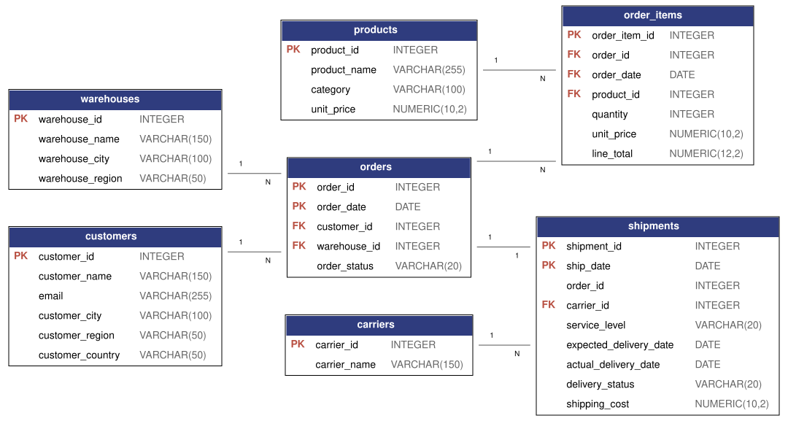

# Sankofa Freight Networks — CSV to PostgreSQL Data Warehouse Migration

## Description

Sankofa Freight Networks is a logistics and supply chain company
operating across Ghana whose entire operation runs off a single flat
CSV export — one row per product per order, every customer, warehouse,
and shipment detail repeated on every line. This project migrates that
750,000-order flat file into a normalized, partitioned PostgreSQL data
warehouse: a `pandas` ETL pipeline cleans and splits the raw export into
seven relational tables, and the two largest tables (`orders` and
`shipments`) are range-partitioned by year so date-filtered reporting
stays fast as order history grows. The result supports both day-to-day
transactional operations (OLTP) and multi-year analytical reporting
(OLAP) from the same database.

## Tools & Technologies

[](https://www.python.org/)
[](https://pandas.pydata.org/)
[](https://jupyter.org/)
[](https://www.postgresql.org/)
[](https://www.sqlalchemy.org/)

## Project Files

| File | What it is |
|---|---|
| [`schema.sql`](./scripts/schema.sql) | PostgreSQL DDL — creates all 7 tables, partitions, constraints, indexes, and the analytics view |
| [`etl_pipeline.ipynb`](./scripts/etl_pipeline.ipynb) | The ETL notebook: extract → clean → split → load → verify, run step by step against Postgres |
| [`analytics_queries.sql`](./scripts/analytics_queries.sql) | Example analytical queries, including a partition-pruning demo |
| [`data_dictionary.md`](./others/data_dictionary.md) | Column-by-column reference for every table: types, keys, nullability, notes |
| [`schema_design_rationale.md`](./others/schema_design_rationale.md) | Explains the normalization thinking behind the schema — why each table exists and what was traded off |
| [`erd.png`](./others/sankofa_erd.png) / [`erd.svg`](./others/erd.svg) | The entity-relationship diagram, in image and Mermaid form |
| [`slide_content.md`](./slide_content.md) | Case-study slide content for presenting this project |
| [`requirements.txt`](./requirements.txt) | Python package dependencies |

## Quick Start

```bash
# 1. Install dependencies
pip install -r requirements.txt
pip install jupyter

# 2. Generate the raw "business" CSV (only needed once)
python 01_generate_raw_data.py

# 3. Create the database and run the schema script
createdb logistics_db
psql -U postgres -d logistics_db -f 02_schema.sql

# 4. Open the notebook and run all cells top to bottom
jupyter notebook 03_etl_pipeline.ipynb
#    -> update the connection settings in the second code cell first

# 5. Explore the data
psql -U postgres -d logistics_db -f 04_analytics_queries.sql
```

## Schema at a Glance


[`data_dictionary.md`](./others/data_dictionary.md) for every column, and
[`schema_design_rationale.md`](./others/schema_design_rationale.md) for the
reasoning behind the design; including where and why the schema
intentionally departs from strict normalization.


